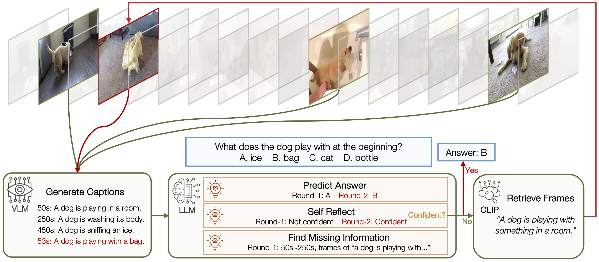

# VideoAgent: Long-form Video Understanding with Large Language Model as Agent

[](https://lbesson.mit-license.org/)
[](https://www.python.org/downloads/release/python-311/)
[](https://pytorch.org/get-started/previous-versions/#v21)
[](https://github.com/ambv/black)

This repo provides the PyTorch source code of our paper: [VideoAgent: Long-form Video Understanding with Large Language Model as Agent](https://arxiv.org/abs/2403.10517) (**ECCV 2024**). Check out project page [here](https://wxh1996.github.io/VideoAgent-Website/)!

## 🔮 Abstract

Long-form video understanding represents a significant challenge within computer vision, demanding a model capable of reasoning over long multi-modal sequences. Motivated by the human cognitive process for long-form video understanding, we emphasize interactive reasoning and planning over the ability to process lengthy visual inputs. We introduce a novel agent-based system, VideoAgent, that employs a large language model as a central agent to iteratively identify and compile crucial information to answer a question, with vision-language foundation models serving as tools to translate and retrieve visual information. Evaluated on the challenging EgoSchema and NExT-QA benchmarks, VideoAgent achieves 54.1% and 71.3% zero-shot accuracy with only 8.4 and 8.2 frames used on average. These results demonstrate superior effectiveness and efficiency of our method over the current state-of-the-art methods, highlighting the potential of agent-based approaches in advancing long-form video understanding.


</img>

## 🚀 Getting Started

<!-- 1. Install dependencies:
  ```bash
  pip install -r requirements.txt
  ```

2. Login [wandb](https://wandb.ai) account:
  ```bash
  python clip_server.py 8888
  ```

3. Eval on EgoSchema: -->
  ```bash
  download files from https://drive.google.com/drive/folders/1ZNty_n_8Jp8lObudbckkObHnYCvakgvY?usp=sharing
  python main.py
  python parse_results.py
  ```


<!-- ## 💼 Customized Usage

If you want to use VisDiff on your own datasets, you can follow the following steps.

### 1. Convert Datasets

Convert your dataset to CSV format with two required columns `path` and `group_name`. An example of the CSV files can be found in [data/examples.csv](data/Examples.csv).

### 2. Define Configs

To describe the differences between two datasets, we need a `proposer` and a `ranker`. The proposer randomly samples subsets of images to generate a set of candidate differences. The ranker then scores the salience and significance of each candidate.

We have implemented different proposers and rankers in [components/proposer.py](./components/proposer.py) and [components/ranker.py](./components/ranker.py). To use each of them, you can edit arguments in [configs/base.yaml](./configs/base.yaml).

We put all the general arguments in [configs/base.yaml](./configs/base.yaml) and dataset specific arguments in [configs/example.yaml](./configs/example.yaml).

### 3. Setup Servers

We unify all the LLMs, VLMs, and CLIP to API servers for faster inference. Follow the instructions in [serve/](./serve/README.md) to start these servers.

For example, if you use BLIP-2 + GPT-4 as proposer and CLIP as ranker, you need to start the following servers:
```bash
python serve/clip_server.py
python serve/vlm_server_blip.py 
```

### 4. Describe Differences

Finally, you can run the following command to describe the differences between two datasets:
```bash
python main.py --config configs/example.yaml
```

## 📄 Reproduce Paper Results

### 📊 VisDiffBench (Section 5 in Paper)

To evaluate our system, we collected VisDiffBench, a benchmark of 187 paired image sets with ground truth difference descriptions ([download link](https://drive.google.com/file/d/1vghFd0rB5UTBaeR5rdxhJe3s7OOdRtkY)). To evaluate performance on VisDiffBench, we ask VisDiff to output a description for each paired set and compare it to the ground truth using [GPT-4 evaluator](./components/evaluator.py).

VisDiffBench is collected from the following datasets:

- PairedImageSets ([Collection Code](./data/pairedimagesets/)) 
- [ImageNetR](https://github.com/hendrycks/imagenet-r)
- [ImageNet*](https://huggingface.co/datasets/madrylab/imagenet-star)

To evaluate VisDiff, you can run the codes in [sweeps/](./sweeps/):
```bash
python sweeps/sweep_pairedimagesets.py
python sweeps/sweep_imagenet.py
```

### 💎 Applications (Section 6 in Paper)

For each application, we provide the corresponding codes and usages in [applications](applications/) folder. -->

## 🎯 Citation

If you use this repo in your research, please cite it as follows:
```
@inproceedings{VideoAgent,
  title={VideoAgent: Long-form Video Understanding with Large Language Model as Agent},
  author={Wang, Xiaohan and Zhang, Yuhui and Zohar, Orr and Yeung-Levy, Serena},
  booktitle={European Conference on Computer Vision (ECCV)},
  year={2024}
}
```
